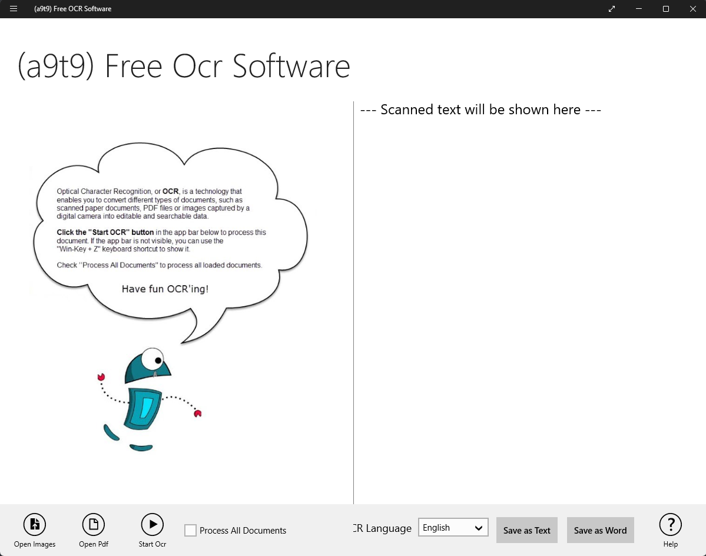

# hstk – Headline Snap Toolkit

This project contains a collection of tools for creating a database of Headline Snaps ([What are Headline Snaps?](./assets/WHAT.md)) as text via OCR, and commands for interfacing with the database. There are several built-in tools for analyzing the data, including data visualization functions.

## Table of Contents

- [Prerequisites](#prerequisites)
- [Installation](#installation)
- [Usage](#usage)
- [Converting non-compliant headline snaps](#using-a9t9-to-convert-legacy-or-non-compliant-headline-snaps)
- [Installing Tessertact executable on Windows](#installing-tesseract-executable-on-windows)

## Prerequisites

(Make sure these are separated into 2 categories, one for solely interfacing with the database/playing around, and the other for adding new snaps to the database. Prerequisites vary based on these 2 things.)

## Usage
TODO

## Installation
TODO

## Using a9t9 to convert legacy or non-compliant headline snaps

In some cases, you might need to use [a9t9](https://github.com/A9T9/Free-OCR-Software), a free and open source OCR GUI application for Windows, for OCRing some legacy headline snaps, i.e., headline snaps which do not follow the [guidelines](#headline-snap-guidelines) (background not black, text too high in the frame, etc.). This software is (for one reason or another) more capable of OCRing these non-compliant snaps than our Tesseract-based pipeline.

### Instructions

(Windows only) Prepare a folder of the all the non-compliant headline snaps you need to convert to text. Open a9t9 (example below), click "Open Images", and navigate to your folder. Select all images in the folder. After a9t9 is finished loading the images in, tick the box "Process All Documents", then click "Start Ocr". After the process is complete, you will see all OCRed images on the right side of the window. Click "Save as Text" and save the file to `/hsdb/scripts`, naming it `a9t9.txt` (filename is important!).

<p align="center"></p>

Now you can invoke the script `clean-a9t9.py` by running

```{python}
python clean-a9t9.py
```

The cleaned file will be output to `/hstk/scripts/cleaned.txt`.

## Installing Tesseract executable on Windows

The link to the installer for the Tesseract executable on Windows can be found [here](https://github.com/UB-Mannheim/tesseract/wiki).

TODO detail what to do with the output file now

