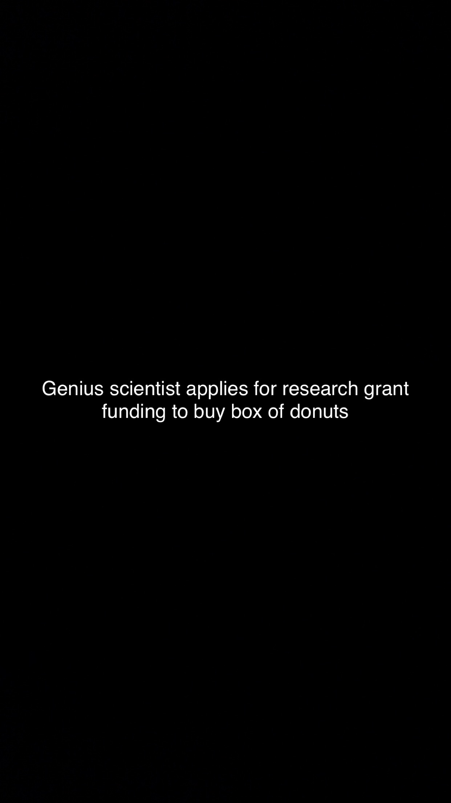

## Headline Snap creation guidelines

In order for the Tesseract-based pipeline in the toolkit to work optimally, the following guidelines should be adhered to when creating a new Headline Snap (via Snapchat).

1. Completely black background
2. White text
3. Text as close to the center of the screen (vertically) as possible

Example:

